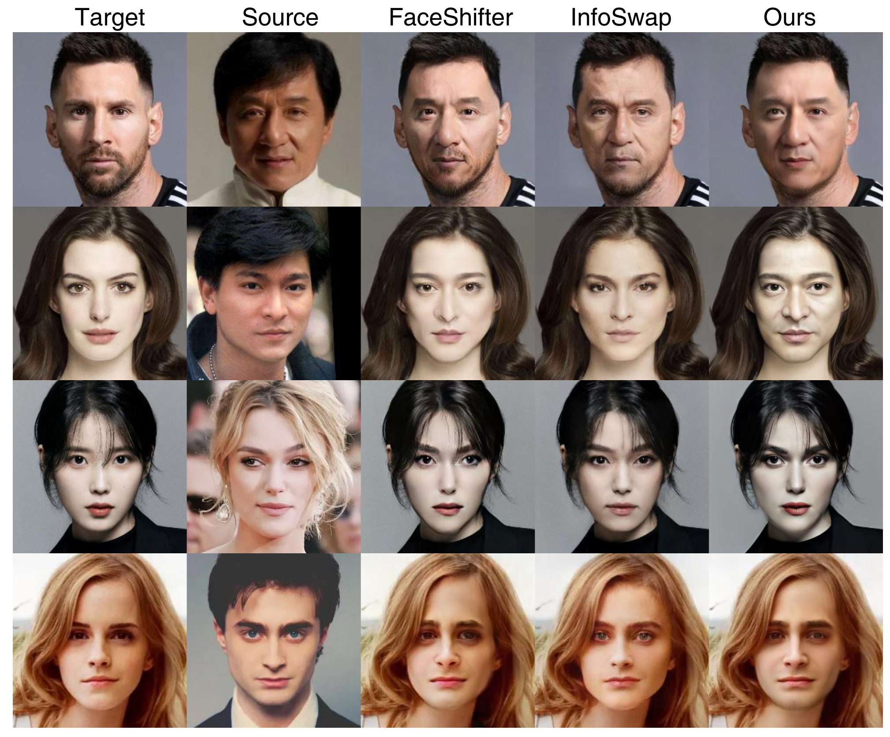
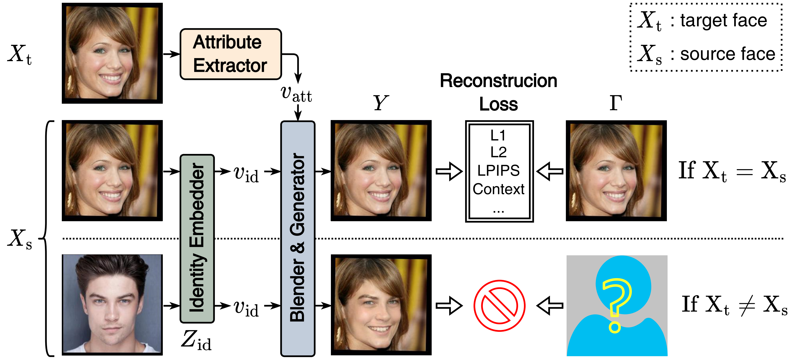
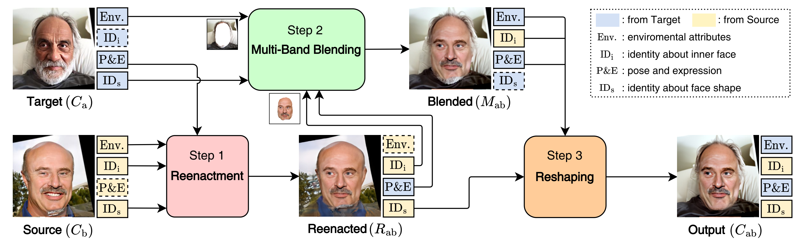
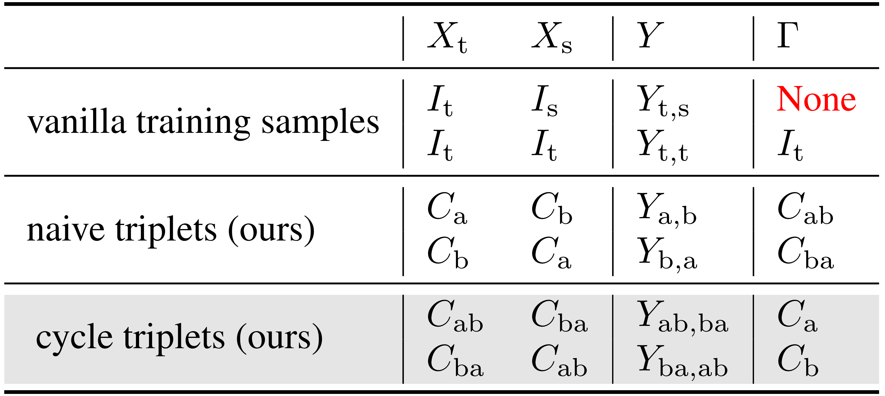
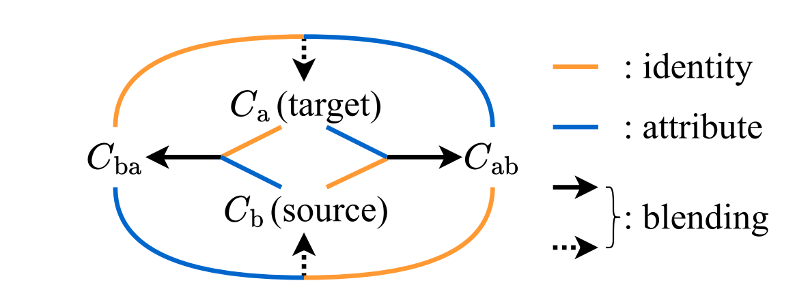

# ReliableSwap: Boosting General Face Swapping Via Reliable Supervision

<a href='https://arxiv.org/abs/2306.05356'></a> &nbsp; 
<a href='https://reliable-swap.github.io/'></a> &nbsp; 
[](https://huggingface.co/spaces/ygtxr1997/ReliableSwap_Demo) &nbsp; 

<div>
<span class="author-block">
<a href="https://github.com/ygtxr1997" target="_blank">Ge Yuan</a><sup>1,2,+</sup></span>,
<span class="author-block">
<a href="https://scholar.google.com/citations?user=ym_t6QYAAAAJ&hl=zh-CN&oi=sra" target="_blank">Maomao Li</a><sup>2,+</sup>,
</span>
<span class="author-block">
    <a href="https://yzhang2016.github.io" target="_blank">Yong Zhang</a><sup>2,*</sup>,
</span>
<span class="author-block">
<a href="https://scholar.google.com/citations?user=CCUQi50AAAAJ" target="_blank">Huicheng Zheng</a><sup>1,*</sup>
</span> (+ Equal Contributions, * Corresponding Authors)
</div>

  
<div class="is-size-5 publication-authors">
    <span class="author-block">
    <sup>1</sup> Sun Yat-sen University &nbsp;&nbsp;&nbsp;
    <sup>2</sup> Tencent AI Lab &nbsp;&nbsp;&nbsp;
    </span>
</div>
<br>

**TL;DR: A general face swapping framework that:**

🎯 solves no image-level guidance <br>
👩‍❤️‍👩 enhances source identity preservation <br>
♾️ is orthogonal and compatible with existing methods <br>



### Updates

* **2023/06/25:** Code released!

### What Problems We Solve



During face swapping training, the re-construction task (used when $X_{\rm{t}}=X_{\rm{s}}$) cannot be used as the proxy anymore when $X_{\rm{t}} \neq X_{\rm{s}}$, lacking pixel-wise supervison $\Gamma$.

### How It Works



<div align="center">

</div>

We first use real images $C_{\rm{a}}$ and $C_{\rm{b}}$ to synthesize fake images $C_{\rm{ab}}$ and $C_{\rm{ba}}$.
This synthesizing stage preserves the **true source identity and target attributes** based on Face Reenactment, Multi-Band Blending, and Face Reshaping.



Then based on the **cycle relationship**, for face swapping training stage, we use *fake* images as inputs while *real* images as pixel-level supervisons $\Gamma$, keeping the output domain close to the *real* and natural distribution and solving the non-supervision issue.
In this way, the trainable face swapping network is guided to generate **source identity-consistency** swapping results, while also keeping **target attributes**.


More details can be found in our [project](https://reliable-swap.github.io/) page.


### Usage

1. [Environment Preparation](./environment_preparation.md)
2. [Training](./training.md)
3. [Testing](./testing.md)
4. [Constructing Naive/Cycle Triplets by Yourself (Optional)](./supervision/readme.md)

### TODO

- [x] release code
- [ ] extending to $512^2$ resolution


### BibTex

```tex
@article{yuan2023reliableswap,
    title={ReliableSwap: Boosting General Face Swapping Via Reliable Supervision},
    author={Yuan, Ge and Li, Maomao and Zhang, Yong and Zheng, Huicheng},
    journal={arXiv preprint arXiv:2306.05356},
    year={2023}
}
```

### 📢 Disclaimer

This is not an official product of Tencent. This repository can only be used for personal/research/non-commercial purposes.

Free free to contact us if you feel uncomfortable.
