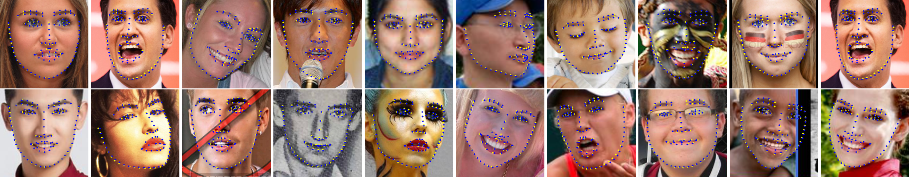

# Heatmap Regression via Randomized Rounding
----

**[2020/09/02]**: the paper is available on [ArXiv](https://arxiv.org/abs/2009.00225v2).

**[2020/10/28]**: add new models for 106 facial landmarks.

**[2021/09/21]**: add new models for 68 facial landmarks (see [models/README.md](models/README.md)).


## Introduction

This repo contains the facial landmark detection code for "Heatmap Regression via Randomized Rounding".




## Demo

````bash
export PYTHONPATH=./:$PYTHONPATH
python examples/demo.py --image data/demo.jpg --model models/wflw/hrnet18_256x256_p2/
````


## Test on [WFLW](https://wywu.github.io/projects/LAB/WFLW.html) (98 facial landmarks)

````bash
python examples/test_wflw.py --model models/wflw/hrnet18_256x256_p1/
````

| Backbone | BBox | Resolution | #Params | FLOPs | NME (%)| 
|:--:|:--:|:--:|:--:|:--:|:--:|
| HRNet-W18 | P1 | 256x256 | 9.69M | 4.84G | 3.81 |
| HRNet-W18 | P2 | 256x256 | 9.69M | 4.84G | 3.95 |
| MobileNetV2 | P2 | 256x256 | 0.60M | 0.51G | 4.45 |
| MobileNetV2 | P2 | 160x160 | 0.60M | 0.20G | 4.58 |
| MobileNetV2 | P2 | 128x128 | 0.60M | 0.13G | 4.72 |


## Test on [LaPa](https://github.com/JDAI-CV/lapa-dataset) (106 facial landmarks)

````bash
python examples/test_lapa.py --model models/lapa/hrnet18_256x256_p2/
````

| Backbone | BBox | Resolution | #Params | FLOPs | NME (%)|
|:--:|:--:|:--:|:--:|:--:|:--:|
| HRNet-W18 | P2 | 256x256 | 9.69M | 4.86G | 1.40 |
| MobileNetV2 | P2 | 256x256 | 0.60M | 0.52G | 1.69 |
| MobileNetV2 | P2 | 128x128 | 0.60M | 0.13G | 2.08 |

**NOTE**：All pretrained models can also be downloaded from [google drive](https://drive.google.com/file/d/148gJAnPfgfWl-xc6eLIcjQy9a0HM6Fu9/view?usp=sharing).

## Citation

```
@article{yu2021heatmap,
  title={Heatmap Regression via Randomized Rounding},
  author={Yu, Baosheng and Tao, Dacheng},
  journal={IEEE Transactions on Pattern Analysis and Machine Intelligence},
  year={2021}
}
```


## Contact

Baosheng Yu, baosheng.yu.usyd@gmail.com.


## Acknowledgement

[https://github.com/HRNet](https://github.com/HRNet)

